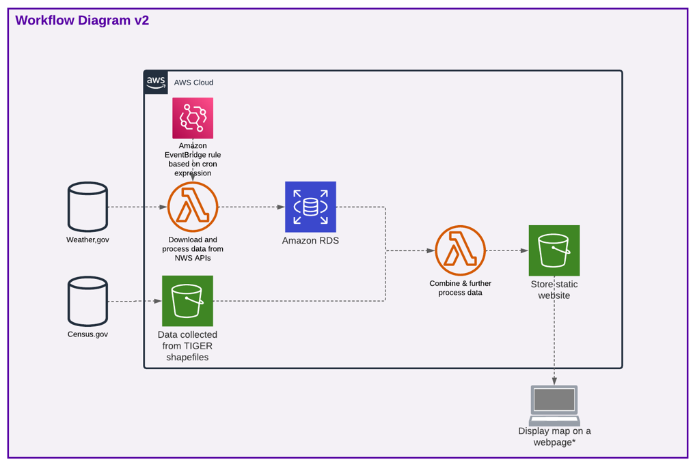

# Under Pressure : Mapping Barometric Variation
A repository for CS6620: Cloud Computing's Final Project.

## Background

While sparse research exists on the topic, large variations in barometric pressure can affect how humans experience pain.
When barometric pressure drops, as it usually does prior to bad weather, it can:
* lead to tissue expansion which puts pressure on joints and worsens arthritis
* lead to pressure differentials between the outside and the inside of the body, which can worsen headaches, especially migraines and headaches caused by sinusitis

However, most studies find insignificant results when data is pooled; barometric pressure has more influence at the individual level. Additionally, more and more individuals are affected with chronic conditions where the pain they feel has the potential to be affected by barometric pressure, but there's relatively little common awareness of the potential impact of atmospheric pressure variation on the sensation of pain, even though it can affect individual perceptions of back pain and tooth pain, among the more chronic conditions listed earlier. 

Additionally, although barometric pressure drops have a stronger association with increased feelings of pain, some individuals are affected by increases in barometric pressure instead. 

## Project Progress

There are two different repositories for this project, marking two different approaches and consolidating all the littler tasks that I had set for myself. 

### underpressure

[The other repository](https://github.com/smr-j/underpressure) is the ancestor to this one, and it uses boto3 to create an S3 bucket that would collect information for each location pulled from the weather.gov APIs as well as store the static website that displays the output map. However, at this stage in time, this project simply creates the S3 bucket and then carries out the remaining tasks in the current workflow, namely, creating a static website that displays a map with points that are color-coordinated based on the amount of pressure variation and also display some other information when clicked on.

### How to Run underpressure

In order to see the output of that original underpressure repository, it should first be cloned locally. Once cloned, navigate into the src folder and use `docker-compose` to stand up the container based on the `compose.yml` file. The resulting `src-application-1` container, when checked with docker logs, will provide the link to the local static website that displays the map output.

#### underpressurepublic

Meanwhile, this repository replaces boto3 with Terraform and thus uses Terraform to create an S3 bucket that, in an ideal situation, would contain an object for each location that is a point on the map. The object stores information for each location pulled from the weather.gov APIs. Given that everything is Dockerized, I did not need to use S3 to store the website. This is in some ways simpler than its predecessor, mostly because I was focused on ensuring that Terraform was integrated with everything else. 

# How to Run underpressurepublic

In order to see the output of this underpressurepublic repository, it should first be cloned locally. Once cloned, navigate into the src folder and use `docker-compose` to stand up the container based on the `compose.yml` file. Just like the original repository, the resulting `src-application-1` container is, when checked with docker logs, will provide the link to the local static website that displays the map output. However, initializing and applying Terraform in this folder allows for the creation of the S3 bucket that would store information about the various locations. 

Of course, as I worked on this project, the architecture diagrams changed, and therefore, so did my intended usage of AWS services. Please see [Architecture Diagrams](architecture-diagrams) for more information.

## Challenges

I found several different things to be challenging. 

One of the bigger challenges I faced was with the NWS APIs, which were not well-organized with regards to telling me what information I would be able to pull. I thought I had found an API call that would provide me with barometric pressure, which isn't a common weather metric, but in practice, the barometric pressure field was empty when I applied it to my intended locations in Maine. This led to me populating the current iteration of my project with 'fake' data to create a mockup.

However, the much larger and more relevant struggle is that I also struggled quite a bit with setting up the architecture for this project, although part of that is because the workflows changed as I worked on the project to become more practical or become better-suited to the production environment. Figuring out how to fit Terraform into my existing workflow and how to set up my workflow in general didn't come naturally to me. Understanding how to integrate localstack and docker to create containers that contained mock AWS services took me several false starts. One of the benefits of AWS is its clean interface, but I wanted to be able to use localstack, and in some ways, that meant I made life more difficult for myself. It would've been much easier to set up my S3 bucket and any other resources directly in AWS, but it would also have robbed me of a learning opportunity.

## Reflections

Despite the challenges, I still think this has been a great learning experience and look forward to expanding on this project. I think one of the things that has been hardest for me to learn is that not only are there multiple viable configurations, but also that this high variability means that having even one extra line can cause the code to fail, which made resolving my own errors through crowdsourcing particularly challenging. 

I also genuinely enjoyed reworking the architecture diagrams as I considered what would actually be practical and learned more about AWS' various tools and their pros and cons. 

I still wish that creating infrastructure came to me much more naturally than it does, even after an entire semester of this class, but I'm glad that I've been able to experience so many different things with this assignment, even if most of them were failures. There's something to be said by learning based on learning what not to do first.

## Architecture Diagrams

### Version 1

### Version 2

### Version 3

## Next Steps

I am trying to keep a running list of tasks through the Issues tab, but for me, I have two tasks that I'm prioritizing, depending on what I decide is the better workflow:
* Adding a database to hold the data for the map points (This is currently the most likely next task - using a relational database seems much more practical than the alternative of using an S3 bucket, although there is a potential use case that would use an S3 bucket to hold maps of various regions. This would be very, very far off in the future.)
* Completing the Terraform integration and checking that the S3 bucket can hold objects

## Acknowledgments

A huge thanks to Jim Sheldon for all of his help putting together this project, along with my apologies as I struggled.

## Sources & Consulted Sites

https://barometricpressure.app/content/understanding-high-low-pressure-readings
https://forecast.weather.gov/glossary.php?word=PRES
https://stackoverflow.com/questions/70407525/terraform-gives-errors-failed-to-load-plugin-schemas
https://docs.localstack.cloud/tutorials/s3-static-website-terraform/
https://docs.localstack.cloud/user-guide/integrations/terraform/
https://journals.plos.org/plosone/article?id=10.1371/journal.pone.0216902
https://www.sciencedirect.com/science/article/abs/pii/S0002934306010266
https://onlinelibrary.wiley.com/doi/abs/10.1016/j.ejpain.2011.01.013
https://link.springer.com/article/10.1007/s11916-019-0826-5
https://journals.lww.com/jspinaldisorders/abstract/2002/08000/change_of_barometric_pressure_influences_low_back.5.aspx \

In addition to the specifically called out articles and documentation, I spent a lot of time parsing the documentation for Terraform and LocalStack.
